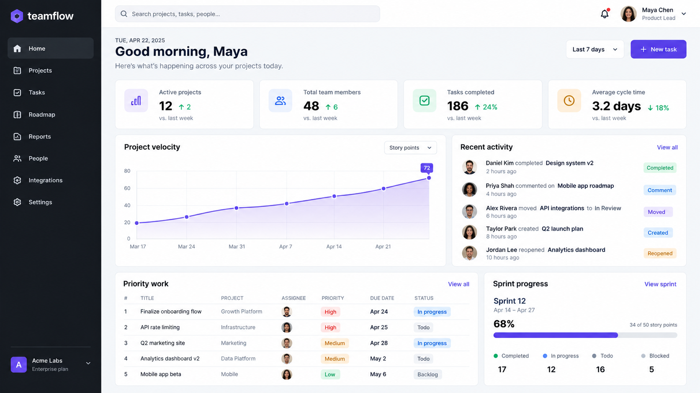
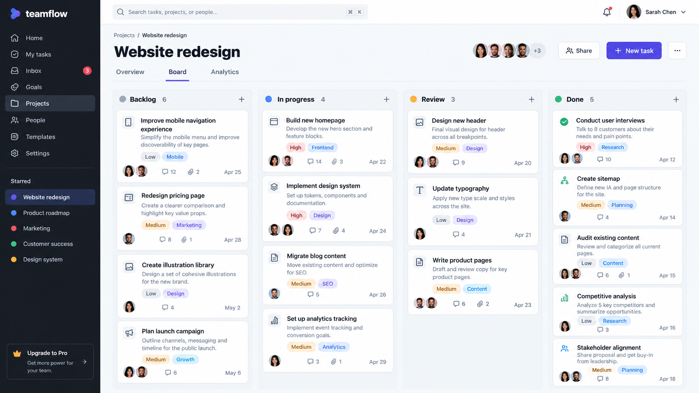

# TeamFlow — Enterprise Project Management Platform

A polished project command center for planning work, coordinating teams, and turning delivery data into clear decisions.

<strong>Next.js · React · TypeScript · FastAPI · PostgreSQL · Redis · Docker · AWS</strong>

## Overview

TeamFlow is an enterprise project-management experience designed around one idea: teams should spend less time updating tools and more time shipping. It brings portfolio health, sprint progress, priority work, team activity, and delivery analytics into a single responsive workspace.

The interactive portfolio build includes a working overview dashboard, searchable Kanban board, analytics workspace, responsive navigation, and task-creation flow. The broader production architecture is designed for a FastAPI/PostgreSQL/Redis backend deployed through Docker on AWS.

> **Portfolio note:** The live project is an interactive product prototype populated with representative demo data. Production integrations and the quantified ~60% workflow reduction describe the intended full-stack case study and should be backed by your own measured results before using the claim publicly.

## Product Preview

The following polished presentation mockups accompany the runnable UI:

> These are presentation mockups, not production-usage evidence. Verify the runnable interface and source for implemented behavior.

## Highlights

- **Executive command center** — project health, sprint completion, saved hours, velocity, and priority work at a glance.
- **Interactive task management** — create tasks, search work instantly, and switch between delivery views without a page reload.
- **Team collaboration model** — activity feed, assignees, comments, attachments, and share controls represented in the UI.
- **Analytics dashboard** — planned-versus-completed work, team workload, cycle time, and collaboration metrics.
- **Enterprise-ready UX** — compact information hierarchy, responsive layouts, clear status encoding, and accessible labels.
- **Agent-ready interface** — exposes task creation as a structured browser action when WebMCP is available.

## Architecture

~~~mermaid
flowchart LR
    UI["Next.js + React UI"] --> API["FastAPI REST/WebSocket API"]
    API --> DB[("PostgreSQL")]
    API --> Cache[("Redis")]
    API --> Files["S3 file storage"]
    UI <--> WS["Real-time events"]
    WS --> API
    Docker["Docker images"] --> AWS["AWS ECS / ALB"]
~~~

| Layer | Technology | Responsibility |
|---|---|---|
| Web | Next.js, React, TypeScript | Responsive workspace, optimistic UI, dashboards |
| API | FastAPI, Pydantic | Authentication, RBAC, projects, tasks, files, analytics |
| Data | PostgreSQL | Organizations, memberships, projects, tasks, audit events |
| Realtime | Redis Pub/Sub | Presence, notifications, task updates, cache |
| Storage | Amazon S3 | Secure uploads and time-limited downloads |
| Delivery | Docker, AWS ECS, RDS, ElastiCache | Repeatable deployment and horizontal scaling |

## Core Domain Model

~~~mermaid
erDiagram
    ORGANIZATION ||--o{ MEMBERSHIP : has
    USER ||--o{ MEMBERSHIP : joins
    ORGANIZATION ||--o{ PROJECT : owns
    PROJECT ||--o{ TASK : contains
    USER ||--o{ TASK : assigned
    TASK ||--o{ COMMENT : has
    TASK ||--o{ ATTACHMENT : stores
~~~

## Security Model

- Short-lived access tokens with refresh-token rotation
- Organization-scoped RBAC for owner, admin, manager, member, and guest roles
- Server-side authorization on every project and task mutation
- Signed upload/download URLs with file-size and MIME validation
- Structured audit events for sensitive actions
- Rate limiting and Redis-backed token revocation

## Engineering Decisions

- **Server-owned permissions:** the interface never determines authorization; it only reflects permissions returned by the API.
- **Event-driven updates:** task mutations publish compact events so subscribed workspaces stay current without full refetches.
- **Measured dashboards:** analytics are built from durable task events rather than mutable current-state snapshots.
- **Deployment parity:** local and hosted environments share container definitions and environment-variable contracts.

## Run Locally

~~~bash
pnpm install
pnpm dev
~~~

Then open the local URL printed by the development server.

## Suggested Production API

~~~text
POST   /auth/login
GET    /organizations/{org_id}/projects
POST   /projects/{project_id}/tasks
PATCH  /tasks/{task_id}
POST   /tasks/{task_id}/attachments
GET    /projects/{project_id}/analytics
WS     /workspaces/{workspace_id}/events
~~~

## Roadmap

- FastAPI service and OpenAPI client generation
- PostgreSQL migrations and seed fixtures
- Redis-backed presence and notification fan-out
- S3 multipart upload pipeline
- Integration tests for cross-tenant access controls
- Docker Compose development environment and AWS infrastructure

## Resume Summary

> Developed TeamFlow, an enterprise project-management SaaS experience with role-based collaboration, task workflows, file-sharing patterns, and analytics dashboards. Designed a scalable Next.js/FastAPI architecture using PostgreSQL, Redis, Docker, and AWS, with automated tracking workflows intended to reduce repetitive project operations.

---

Built as a portfolio case study. Replace demo metrics with verified production measurements before presenting them as real-world outcomes.
